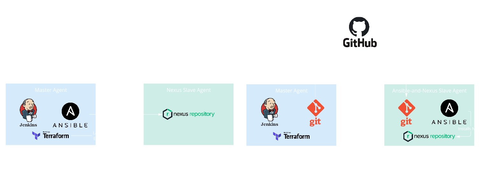

# Nexus_Installation
Installing Nexus Repository using Jenkins, Ansible and Terraform.

In this repo, we will go for the long way to practice more on using Jenkins.
## Jenkins Pipeline Stages:
- On the master agent:
1. Apply the infrastructure using Terraform, create an AWS key pair and create the configuration files of Ansible.
2. Save the AWS private key as Jenkins credential using Jenkins CLI and API.
3. Push the configuration files of Ansible to GitHub repo.
4. Configure the EC2 created using Terraform as a Jenkins slave agent using  Jenkins CLI.
- On the slave agent:
5. Install Ansible and Git, pull the configuration files and run the Ansible playbook locally (localhost).
- On the master agent:
6. Reset the GitHub repo by destroying the Terraform `local_file` resources and pushing the changes to the repo.
